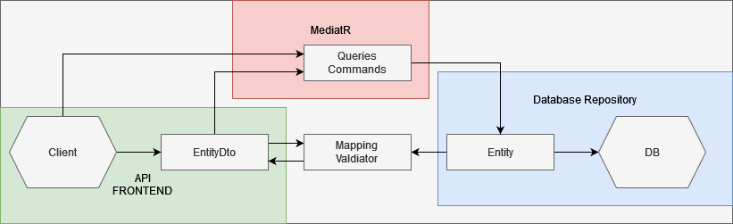
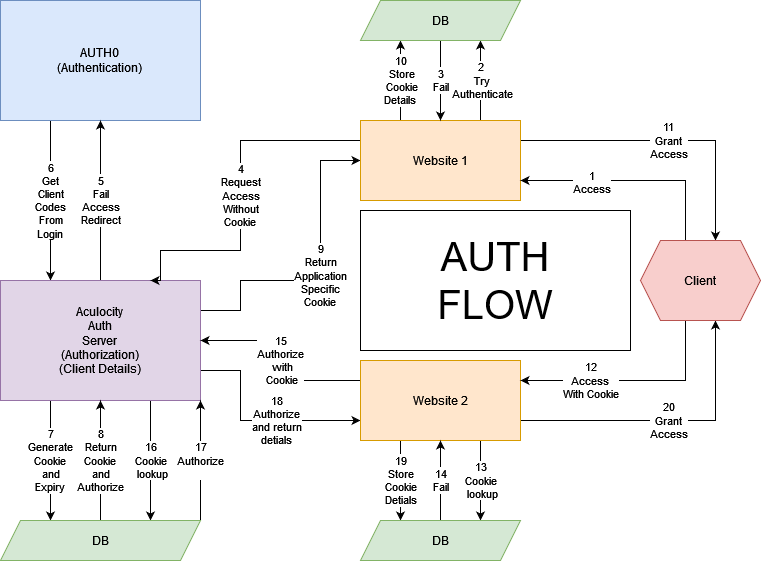

# The Template

# Basics

## Introduction

This project is designed to form a template for any future development. The template, as of 2023, contains the current coding standards and practices, including the [Clean Code Architecture](https://awesome-architecture.com/clean-architecture/).

## Work outstanding:

+ Fix get sub classes
+ Implement testing
+ Implement Authorization
+ Implement Front-End

## Getting Started

1. Clone Repository
2. Build repository, including all the associated packages.
3. Make sure that it is the latest code.
4. Setup Database connection.
5. Run Program.
6. Remove all the unneccesary template features (for example the front-end if only a backend is required.)
7. Begin the coding process.
8. Document everything.

## Build and Test

TODO: Testing Not implemented.

## Contribute

Since the project might for the basis for a lot of things to come, edits in this project could have far reaching effects. The ideal would be that the project does not become a NuGet package, but a standalone template. If it should become a package, I suggest the code be code reviewed by at least 1 Junior and 1 Senior Developer before release.

# Current File design

Please refer to the different folders for their respective XML design structures. I will attempt to explain most the system, but writing it in text might be somewhat unclear.

##  Design Overview

The design follows the Clean code Architechture.

Domain <- Application <- Infrastructure <- Presentation.

The **domain** forms the core of the project. Within the domain one would most likely find the base classes and Database entities required by the entire system. With MediatR events, the domain also includes the bases for events to occur. Common exceptions to Value objects can also be found here.

The **Application** layer I often call the Interface layer where all the interfaces are generated to be implemented in the next layer. The Application object (DTO's) bases and entities are created here. Middleware and DB commands are also placed here. The "Business Logic/Rules" would also be found here.

The **Interface** layer is used to implement die Application layer to be injected into the Presentation layer. The different database repositorys are found here, along with the database configurations. The interface is also a great place to add the security implementation and code factories.

The **Presentation** layer uses all of the rest to become the API or Front-End, but only trades in Application layer entities, never in domain entities.

The mapping can be explained as such for a single entity

1. **Domain**
    * Entity
2. **Application**
    * EntityDto
    * Entity Mapping
    * Entity Validation
    * Entity CQRS
3. **Interface**
    * EntityConfiguration
4. **Presentation**
    * EntityControllers

## Entity Flow

Ideally one would only communicate in commands and/or Dtos from the client side. The inputs would be validated and converted to entities to be put into the DB. Queries do not follow the same path, as queries return EntityDto's. A command should Ideally never return something other than Success Code 200 Or I'm a Teapot Code 418.

## Folders
+ Domain
    + Bases
        + Contains base classes for **Entity** objects, events, users ect.
    + Entities
        + Contains folder subject seperated Entity classes to be used throughout the system
    + Enums
        + Generalised enums
    + Events
        + Contains folder subject seperated Entity **events**
    + Exceptions
        + General exceptions, likely relating to the Value Object
    + ValueObjects
        + Contains all value objects
            + Value objects are immutable types thank can't be changed, only very specifically intatiated.
            + An example would be the Truck serial codes.
+ Application
    + Bases
        + Contains base records for EntityDto objects
    + Entities
        + Contains folder subject sperated Entity objects including:
            + Mapping
            + Validation
            + Commands
            + Queries
            + **EntityDtos**
    + Exception
        + Contains application specific exceptions, like Validation Failed Exception
    + Extentions
        + General static extentions specifically for the application layer
    + Interfaces
        + Contains all the interfaces used by both the application and Infrastructure layer.
    + Middleware
        + Contains all actions performed before interaction with database. Authorization is a good example
    + Models
        + Models specifically used by the application layer. I am unsure about the name, can be modified.
+ Infrastructure
    + Context
        + All the needed implementations of the Interfaces from the application layer.
        + Most notibly the database context lives here.
    + EntityConfiguration
        + Contains folder subject sperated Entity objects configurations for the database building.
    + Extentions
        + General static extentions specifically for the infrastructure layer
    + Factory
        + I prefer the factory design method.
        + Contains all the factory creations of implementations of interfaces. Most notibly the logger factory is here.
    + Security
        + Seperated from the rest of the services, the security deals with specific security implementations.
    + Services
        + Useful services, for example the logging service and get user service. Should always be implementations of interfaces.

# Adding new Entity to the System
1. **Domain**
    1. Add **entity** to Entities folder
    2. Inherit from:
        1. **BaseEntity** for Normal entity
        2. **BaseAudit** entity to have changes saved withing the same table row
        3. **BaseAuditTrailEntity** to perform the function of BaseAudit as well as send the changes to the audit table for the data scientist.
2. **Application**
    1. Add **entity dto** to Entities folder.
    2. Add the mapping by inheriting **IMapper**
    3. Add the validation by inheriting **IValidation**
    4. Add queries like the examples
    5. Add the commands like the example.
    6. Add any other business logic that one can conceive here.
    7. Use Paginated list if needed.
3. **Infrastructure**
    1. Add entity configuration to the EntityConfiguration Folder
    2. Add the new configuration to the ApplicationContext in DatabaseContext/ContextImplementation folder.
4. **Presentation**
    1. Add commands and queries to the Controllers or API Controllers
5. Celebrate how easy it was to add an entity.

# Authorization and Authentication
[comment]: 
The Auth system has been redesigned. I like the concept of the previous methods and will include it eventually